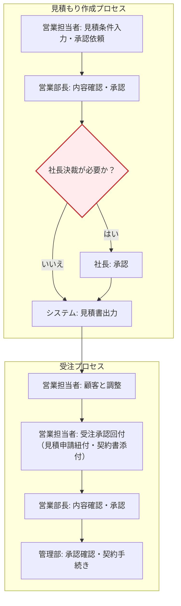

# 取引管理システム 要件定義書

## 1. 文書情報

### 1.1 文書名
取引管理システム 要件定義書

### 1.2 作成目的
本書は、企業における見積・受注、発注、請求・支払いを一元管理する取引管理システムの要件を定義し、業務部門、システム部門、開発担当者の共通認識を形成することを目的とする。

### 1.3 参照文書
- `business_system_spec_draft.md`

### 1.4 想定読者
- 業務部門責任者
- 営業担当者
- 購買担当者
- 経理担当者
- システム管理者
- 開発担当者
- プロジェクトマネージャー

### 1.5 用語定義
| 用語 | 定義 |
| --- | --- |
| 案件 | 顧客との商談、契約、プロジェクトなど、複数の取引伝票を束ねる管理単位 |
| 見積 | 顧客に提示する金額・条件の提案情報 |
| 受注 | 顧客からの正式な注文確定情報 |
| 発注 | 仕入先または外注先に対する注文情報 |
| 請求 | 顧客に対する売上請求情報 |
| 支払 | 仕入先に対する支払予定または支払実績情報 |
| 入金消込 | 入金実績と請求情報を対応付ける処理 |
| 締め処理 | 指定締日単位で請求対象を集計し請求を確定する処理 |

## 2. プロジェクト概要

### 2.1 背景
現行業務では、見積、受注、発注、請求、支払いの情報が Excel、メール、紙帳票、個別システムなどに分散している。そのため、取引の追跡性が低く、転記負荷、請求漏れ、支払い漏れ、承認漏れ、締め処理遅延といった課題が発生している。

### 2.2 目的
本システムにより、以下を実現する。

- 取引ライフサイクルの一元管理
- 業務の標準化と属人化の抑制
- 承認統制と監査証跡の整備
- 売上、原価、粗利、未収、未払の可視化
- 月次締め業務の効率化

### 2.3 対象業務
- 見積管理
- 受注管理
- 発注管理
- 請求管理
- 入金管理
- 支払い管理
- 取引先、商品、ユーザ等のマスタ管理
- 管理会計向け集計、ダッシュボード表示

### 2.4 対象外
- 会計システムそのものの代替
- 高度な在庫最適化
- 生産管理、倉庫管理
- 銀行振込データの自動送信
- 法制度への完全準拠機能の保証

## 3. システム化方針

### 3.1 基本方針
- 案件を中心に、見積、受注、発注、請求、入金、支払いを相互に関連付ける
- 同一データの二重入力を最小化し、前工程の伝票を後工程へ引き継げる構造とする
- 承認が必要な伝票はワークフローを通過しなければ確定できない
- 重要操作はすべて履歴として記録する
- 初期リリースでは業務継続に必要な中核機能を優先し、拡張性を確保する

### 3.2 管理単位
- 案件
- 取引伝票
- 取引先
- 伝票明細

### 3.3 システム利用部門
- 営業部門
- 営業事務部門
- 購買部門
- 経理部門
- 管理部門

## 4. 現行課題と解決方針

| 課題 | 原因 | 解決方針 |
| --- | --- | --- |
| 取引状況が追跡しにくい | 情報が分散し伝票同士が関連付いていない | 案件と伝票をキーに一元管理する |
| 二重入力が多い | 見積、受注、請求などで同じ情報を再入力している | 伝票コピー、伝票変換、マスタ参照を標準化する |
| 承認漏れが発生する | メールや口頭で承認を回している | システム承認を必須化し履歴を保存する |
| 締め処理が遅い | 請求対象や支払対象の抽出が手作業 | 締日、支払条件、入金状況で自動集計する |
| 粗利が見えにくい | 売上と原価が別管理 | 受注、発注、請求、支払を横断して集計する |

## 5. 利用者要件

### 5.1 利用者区分
| 利用者区分 | 主な利用目的 |
| --- | --- |
| 管理者 | マスタ管理、権限管理、全体監査 |
| 営業担当 | 案件、見積、受注、請求確認 |
| 営業事務 | 見積登録補助、受注登録、請求作成 |
| 購買担当 | 発注、納品、検収、支払依頼 |
| 経理担当 | 請求確定、入金登録、支払確定 |
| 閲覧専用 | 情報参照、レポート確認 |

### 5.2 利用環境
- 社内 PC ブラウザ利用を前提とする
- モバイルブラウザ参照にも対応する
- 日本語利用を前提とする

## 6. 業務要件

### 6.1 業務フロー要件
業務は以下の基本フローで運用する。

1. 取引先、商品、担当者等のマスタを登録する
2. 営業担当が案件を起票する
3. 見積条件をシステムに入力し、営業部長の承認を依頼する。承認後に見積書がシステムから出力される。
    
    3.1 値引き条件が所定の条件を満たす場合は、社長の承認が必要となる。

    3.2 社長決裁が必要となる条件は管理者がシステムの設定により適宜変更できる。

4. 顧客了承後、見積から受注を作成する

    4.1 受注承認を依頼する際には、見積り申請を紐づけなければならない。

    4.2 紐づけした見積り申請と条件が異なる場合は、受注申請を回付することができないように制御する

    4.3 受注承認の際は契約書または注文書を添付する

    4.4 受注承認は営業担当者が依頼し、営業部長が承認する

    4.5 受注承認後に管理部が契約手続きを行う。

5. 調達が必要な明細に対して発注を作成する
6. 納品予定、納品実績、検収結果を記録する
7. 請求対象を集計し、請求書を発行する
8. 入金を登録し、請求と消込する
9. 支払依頼を作成し、承認後に支払実績を登録する
10. 月次単位で売上、原価、粗利、未収、未払を集計する

### 6.2 受注業務

#### 6.2.1 受注業務フロー
見積作成から受注確定までの業務フローを以下に示す。

#### 6.2.2 受注業務フロー補足要件
- 見積は案件に紐付けて作成できること
- 見積改版時は旧版を履歴として保持し、最新版を識別できること
- 承認が必要な場合、承認済みになるまで顧客提出可否を制御できること
- 顧客からの修正依頼時は、既存見積を複製または改版して再提示できること
- 失注または取消となった見積は理由を記録できること
- 受注作成時は承認済み見積の主要情報を引き継げること
- 受注確定時は受注番号を採番し、後続の発注・請求処理へ連携可能な状態にできること

### 6.4 例外処理要件
- 見積却下時は却下理由を保存できること
- 受注取消時は関連する発注、請求、支払への影響を確認できること
- 請求確定後の訂正は取消または訂正伝票で対応できること
- 一部入金、一部支払、差額入金に対応できること
- 発注後の数量変更時は変更履歴を確認できること

### 6.5 月次管理要件
- 締日単位で請求対象を抽出できること
- 支払予定日単位で支払対象を抽出できること
- 月次売上、月次原価、粗利を案件別、取引先別に集計できること

## 7. 機能要件

### 7.1 機能一覧
| 機能ID | 機能名 | 概要 | 優先度 |
| --- | --- | --- | --- |
| F-01 | ログイン、認証 | ユーザ認証、ログイン管理 | 高 |
| F-02 | ダッシュボード | 承認待ち、売上見込、未収未払等の可視化 | 中 |
| F-03 | 案件管理 | 案件の作成、更新、参照、状況管理 | 高 |
| F-04 | 見積管理 | 見積作成、版管理、承認、PDF 出力 | 高 |
| F-05 | 受注管理 | 受注登録、見積からの転記、進捗管理 | 高 |
| F-06 | 発注管理 | 発注作成、承認、PDF 出力、残管理 | 高 |
| F-07 | 納品、検収管理 | 納品実績、検収結果の登録 | 高 |
| F-08 | 請求管理 | 請求作成、締め処理、PDF 出力、残高管理 | 高 |
| F-09 | 入金管理 | 入金登録、消込、未収管理 | 高 |
| F-10 | 支払い管理 | 支払依頼、支払確定、未払管理 | 高 |
| F-11 | マスタ管理 | 顧客、仕入先、商品、ユーザ、条件管理 | 高 |
| F-12 | 承認管理 | 承認依頼、承認、差戻し、却下 | 高 |
| F-13 | 通知管理 | 承認通知、期限通知、滞留通知 | 中 |
| F-14 | 帳票出力 | 各種帳票の PDF 出力 | 高 |
| F-15 | 検索、一覧、CSV | 条件検索、一覧表示、CSV 出力 | 中 |
| F-16 | レポート | 集計表、粗利表、未収未払一覧 | 中 |
| F-17 | 操作ログ、監査 | 操作履歴、状態遷移履歴の保存 | 高 |

### 7.2 案件管理要件
- 案件番号を自動採番できること
- 案件名、顧客、担当者、予定金額、予定開始日、予定終了日、状態を管理できること
- 案件に対して複数の見積、受注、発注、請求を紐付けられること
- 案件単位で売上、原価、粗利、未収、未払を参照できること

### 7.3 見積管理要件
- 見積を新規作成、複製、改版できること
- 見積番号を自動採番できること
- 明細行に商品、数量、単価、値引、税区分、金額を持てること
- 下書き、承認依頼中、承認済み、失注、取消の状態を持てること
- 承認済み見積から受注を作成できること
- 見積書を PDF で出力できること

### 7.4 受注管理要件
- 見積から受注へ主要情報を引き継げること
- 一部受注、一部納品、一部請求に対応できること
- 受注ごとに納期、受注金額、粗利見込を管理できること
- 受注から発注起票または請求対象化ができること

### 7.5 発注管理要件
- 案件または受注明細から発注を起票できること
- 仕入先別に発注を分割できること
- 発注番号を自動採番できること
- 発注承認フローを経て確定できること
- 発注残数量、発注残金額を確認できること
- 発注書を PDF で出力できること

### 7.6 納品、検収要件
- 発注明細または受注明細に対して納品実績を登録できること
- 数量、納品日、検収日、検収結果、備考を管理できること
- 一部納品、一部検収に対応できること

### 7.7 請求管理要件
- 受注または納品実績をもとに請求を作成できること
- 顧客ごとの締日、支払条件で請求対象を抽出できること
- 複数受注の合算請求に対応できること
- 一部請求、分割請求に対応できること
- 確定後の請求は変更制御できること
- 請求書を PDF で出力できること
- 請求残高を確認できること

### 7.8 入金管理要件
- 請求単位または請求明細単位で入金登録できること
- 一部入金、過不足入金、手数料差引に対応できること
- 入金消込結果を保存できること
- 未収一覧を出力できること

### 7.9 支払い管理要件
- 発注または仕入実績をもとに支払依頼を作成できること
- 支払予定日、支払方法、支払金額、手数料を管理できること
- 支払承認後に支払実績登録できること
- 一部支払、分割支払に対応できること
- 未払一覧を出力できること

### 7.10 マスタ管理要件
- 顧客、仕入先、商品、ユーザ、部門、税率、支払条件等を管理できること
- 顧客ごとの締日、支払サイト、請求先を保持できること
- 商品ごとの標準単価、税区分、利用可否を保持できること

### 7.11 承認、通知要件
- 見積、発注、支払依頼に承認フローを設定できること
- 承認、差戻し、却下の履歴を保持できること
- 承認依頼時および結果確定時に通知できること
- 支払予定日、入金期限、滞留案件について通知できること

### 7.12 検索、レポート要件
- 一覧画面でキーワード検索、条件絞り込み、並び替えができること
- CSV 出力に対応すること
- 案件別、顧客別、月別の売上、原価、粗利を参照できること
- 未収一覧、未払一覧、承認待ち一覧を参照できること

## 8. 画面要件

### 8.1 画面一覧
| 画面ID | 画面名 | 主な利用者 |
| --- | --- | --- |
| S-01 | ログイン画面 | 全利用者 |
| S-02 | ダッシュボード | 全利用者 |
| S-03 | 案件一覧、詳細 | 営業、管理者 |
| S-04 | 見積一覧、登録、詳細 | 営業、営業事務 |
| S-05 | 受注一覧、詳細 | 営業、営業事務 |
| S-06 | 発注一覧、登録、詳細 | 購買、営業、管理者 |
| S-07 | 納品、検収登録画面 | 購買 |
| S-08 | 請求一覧、登録、詳細 | 営業事務、経理 |
| S-09 | 入金登録画面 | 経理 |
| S-10 | 支払依頼、支払登録画面 | 購買、経理 |
| S-11 | マスタ管理画面 | 管理者 |
| S-12 | 承認一覧画面 | 承認者 |
| S-13 | レポート画面 | 管理者、経営者、経理 |
| S-14 | 通知一覧画面 | 全利用者 |

### 8.2 一覧画面共通要件
- ページングまたはスクロールによる一覧表示ができること
- 表示列の並び替え、絞り込みができること
- CSV 出力ができること
- 権限に応じて操作ボタンの表示を制御できること

### 8.3 帳票出力対象
- 見積書
- 受注確認書
- 発注書
- 納品書
- 請求書
- 支払通知書
- 売上集計表
- 粗利集計表
- 未収一覧
- 未払一覧

## 9. データ要件

### 9.1 主なエンティティ
- ユーザ
- ロール
- 顧客
- 顧客担当者
- 仕入先
- 商品、サービス
- 案件
- 見積、見積明細
- 受注、受注明細
- 発注、発注明細
- 納品、検収
- 請求、請求明細
- 入金
- 支払依頼
- 支払実績
- 添付ファイル
- 承認履歴
- 操作履歴

### 9.2 データ管理ルール
- 主要マスタ、主要伝票には一意な識別子を付与すること
- 論理削除を基本とし、監査要件上必要な履歴を保持すること
- 伝票の状態遷移履歴を保存すること
- 伝票間の参照関係を追跡できること
- 作成者、更新者、作成日時、更新日時を保持すること

### 9.3 添付ファイル要件
- 案件、見積、発注、請求等にファイル添付できること
- 権限のない利用者は添付ファイルを閲覧できないこと
- 削除や更新の履歴を追跡できること

## 10. 権限要件

### 10.1 権限制御の基本方針
- ロールベースで権限を付与する
- 作成、参照、更新、承認、出力の単位で権限を制御する
- 伝票種別ごとの承認権限を設定できること

### 10.2 権限マトリクス
| 機能 | 管理者 | 営業担当 | 営業事務 | 購買担当 | 経理担当 | 閲覧専用 |
| --- | --- | --- | --- | --- | --- | --- |
| マスタ管理 | 可 | 一部可 | 一部可 | 一部可 | 一部可 | 不可 |
| 案件管理 | 可 | 可 | 参照可 | 不可 | 参照可 | 参照可 |
| 見積作成 | 可 | 可 | 可 | 不可 | 不可 | 不可 |
| 見積承認 | 可 | 条件付可 | 不可 | 不可 | 不可 | 不可 |
| 受注登録 | 可 | 可 | 可 | 不可 | 不可 | 不可 |
| 発注作成 | 可 | 可 | 可 | 可 | 不可 | 不可 |
| 発注承認 | 可 | 不可 | 不可 | 条件付可 | 不可 | 不可 |
| 請求作成 | 可 | 可 | 可 | 不可 | 可 | 不可 |
| 入金登録 | 可 | 不可 | 不可 | 不可 | 可 | 不可 |
| 支払依頼 | 可 | 不可 | 不可 | 可 | 可 | 不可 |
| 支払確定 | 可 | 不可 | 不可 | 不可 | 可 | 不可 |
| レポート閲覧 | 可 | 可 | 可 | 可 | 可 | 可 |

## 11. 外部連携要件

### 11.1 想定連携先
- 会計システム
- 電子契約システム
- メール送信基盤
- SSO 認証基盤
- 銀行データ連携基盤

### 11.2 連携要件
- 取引先マスタを外部連携できること
- 売上、請求、入金、支払データを外部出力できること
- 初期段階では CSV 連携を想定すること
- 将来的に API 連携へ拡張可能なデータ構造とすること

## 12. 非機能要件

### 12.1 性能要件
- 通常操作における一覧画面表示は 3 秒以内を目標とする
- 明細件数が多い伝票でも業務上許容可能な応答時間を維持すること
- CSV 出力は 1 万件程度を実用的な時間で処理できること

### 12.2 可用性要件
- 平日業務時間帯に安定稼働すること
- 障害発生時に復旧可能なバックアップを取得すること
- 障害時のデータ消失リスクを最小化すること

### 12.3 セキュリティ要件
- ID、パスワードまたは外部認証による利用者認証を行うこと
- 通信は暗号化すること
- ロールベースの権限制御を行うこと
- 操作ログを保存すること
- 添付ファイルのアクセス制御を行うこと

### 12.4 監査要件
- 登録、更新、削除、承認、差戻しなどの重要操作を記録すること
- 誰がいつ何を操作したか追跡できること

### 12.5 拡張性要件
- 将来的な会計連携、電子契約連携に対応しやすい構成とすること
- 追加帳票、追加ロール、追加項目に対応しやすいこと

## 13. 運用要件

### 13.1 運用ルール
- マスタ更新は権限保有者のみが実施できること
- 請求確定後、支払確定後の変更は制限すること
- 月次締め後の修正方法は取消または訂正処理で統一すること

### 13.2 保守要件
- 障害調査に必要なログを取得できること
- マスタ、伝票、帳票の保守容易性を考慮した設計とすること

## 14. 移行要件

### 14.1 初期移行対象
- 顧客マスタ
- 仕入先マスタ
- 商品、サービスマスタ
- ユーザマスタ
- 必要に応じた案件残、受注残、請求残、未払残

### 14.2 移行方針
- 初期導入時は CSV による移行を基本とする
- 移行対象データのクレンジングは事前実施とする
- 残高整合性の確認手順を別途定義する

## 15. 制約事項

### 15.1 業務上の制約
- 承認ルールの最終決定は運用部門との合意が必要
- 売上計上、仕入計上の基準は会計方針に依存する

### 15.2 システム上の制約
- 初期リリースでは高度なワークフロー分岐を限定する
- 初期リリースでは会計連携は CSV を前提とする
- 初期リリースでは通知手段をメール中心とする

## 16. 受入条件

### 16.1 業務受入条件
- 見積から受注、発注、請求、入金、支払いまで基本フローが通ること
- 一部請求、一部入金、一部支払いが業務要件の範囲で処理できること
- 月次の売上、原価、粗利、未収、未払が集計できること

### 16.2 システム受入条件
- 権限制御が利用者区分どおりに機能すること
- 各種帳票が PDF 出力できること
- 承認履歴、操作履歴が参照できること
- 一覧検索、CSV 出力が実行できること

### 16.3 データ受入条件
- 主要マスタが正しく登録、参照できること
- 伝票間の関連が追跡できること
- 請求残、未払残、入金消込結果に整合性があること
